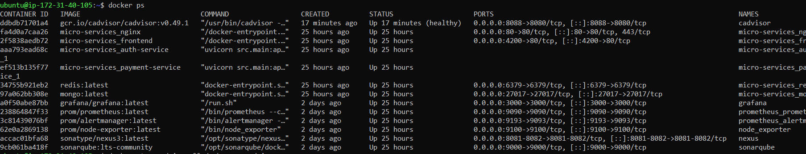
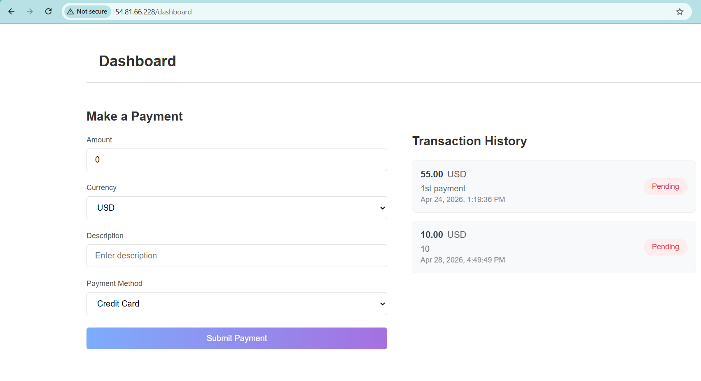
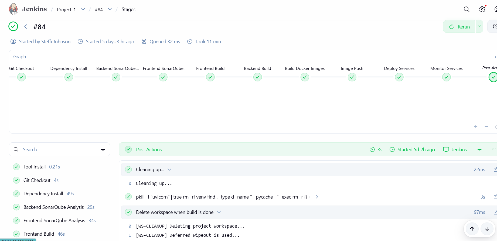
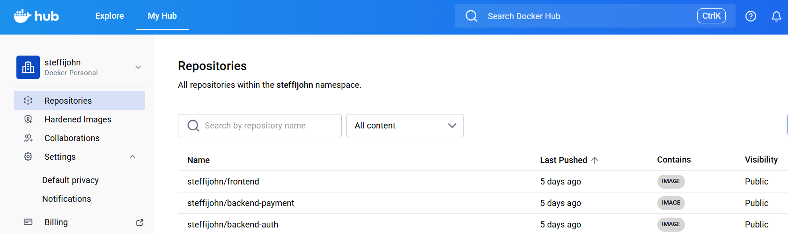
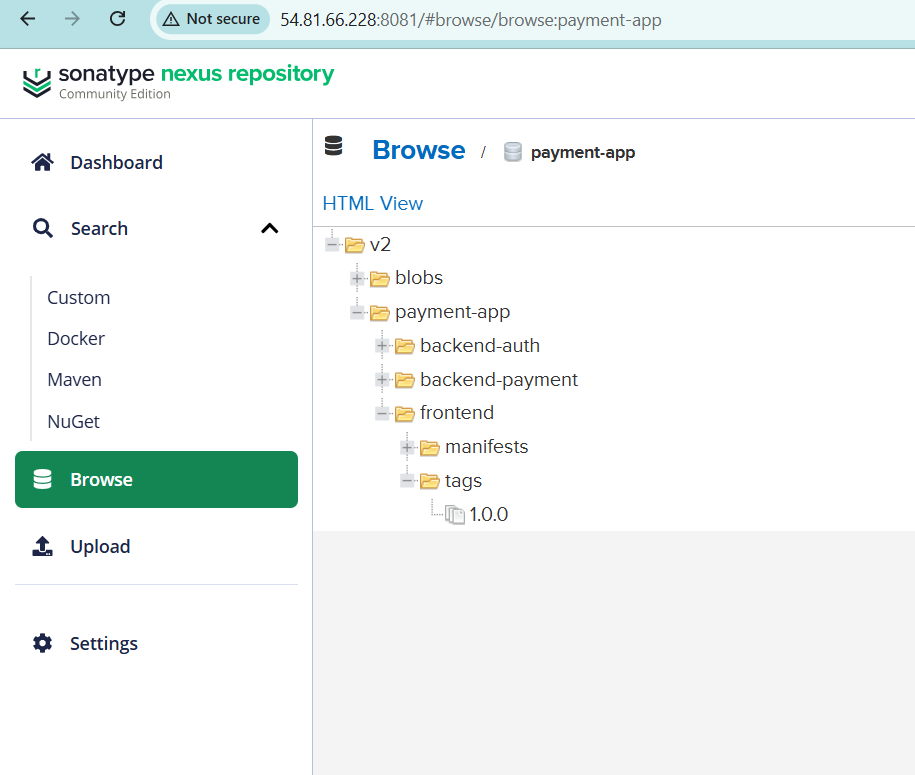
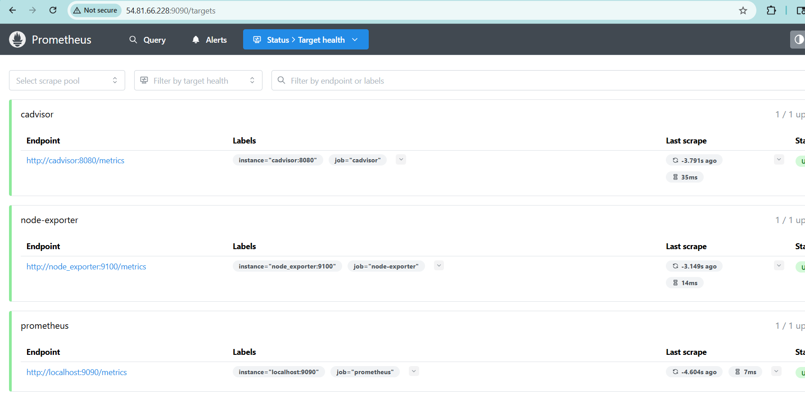
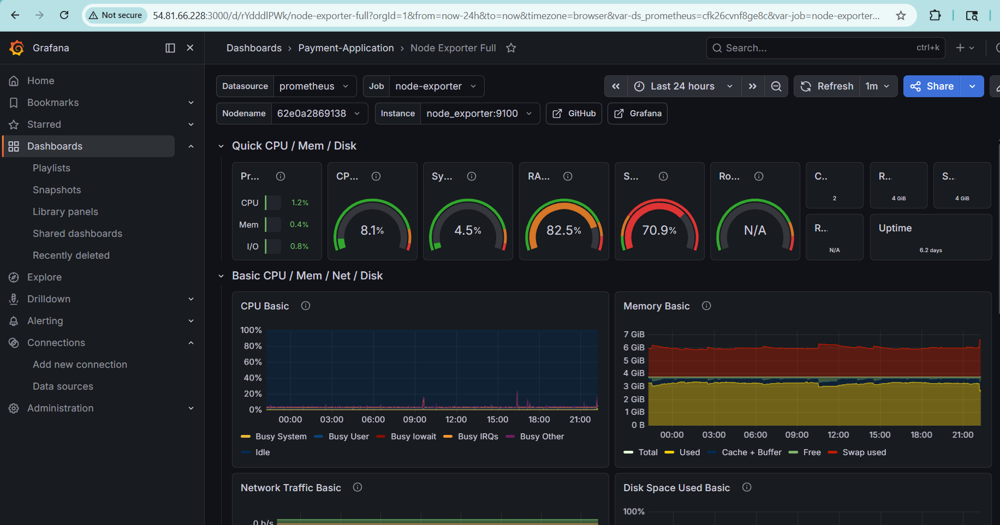

A containerized microservices payment application deployed via a Jenkins CI/CD pipeline on AWS, featuring an automated Prometheus and Grafana observability stack.

Core Tech Stack :

Cloud Infrastructure:  "AWS (EC2, VPC, Security Groups)"

Containerization:  "Docker, Docker Compose"

CI/CD Pipeline:  "Jenkins, SonarQube (Static Analysis), Nexus (Artifacts)"

Observability:  "Prometheus, cAdvisor, Grafana"

Backend/Frontend:  "Python (FastAPI), Angular"

Database:  "MongoDB, Redis"

